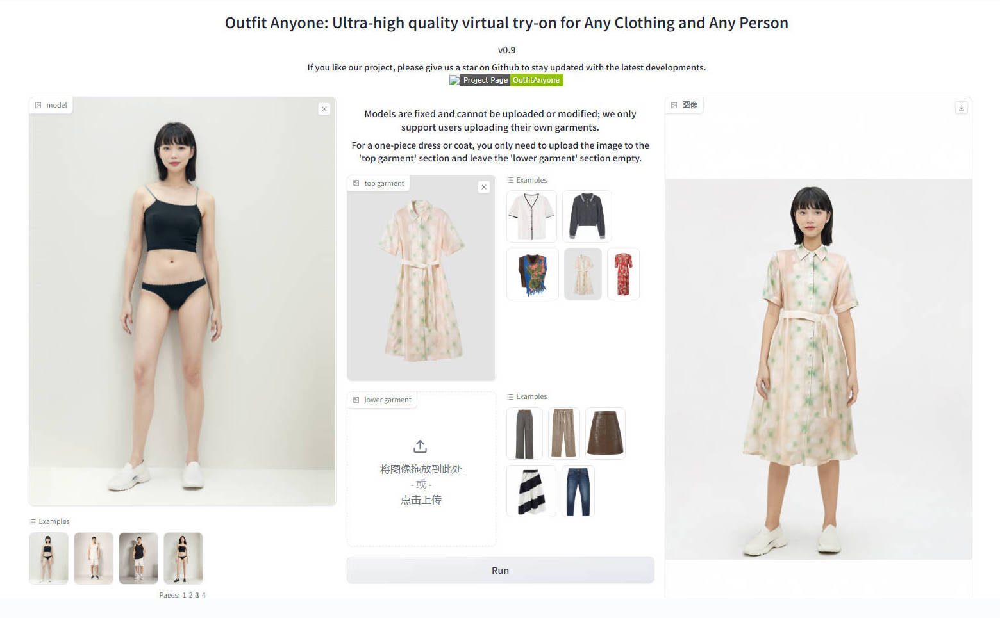
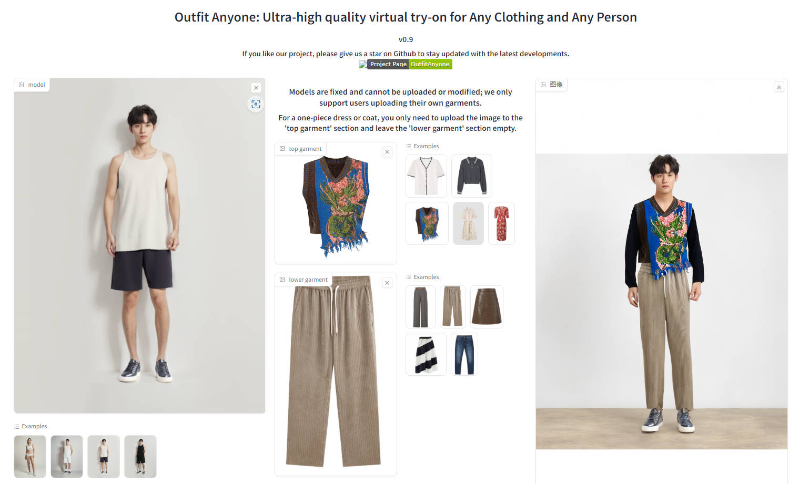
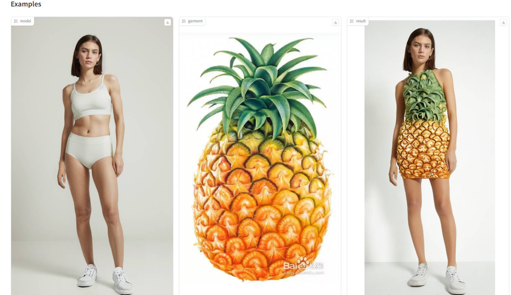

# outfit-anyone
[English](https://github.com/ihmily/outfit-anyone/blob/main/README.md)  | [简体中文](https://github.com/ihmily/outfit-anyone/blob/main/README_CN.md)

Outfit Anyone (Latest Fixed Version): Ultra-high quality virtual try-on for Any Clothing and Any Person

This project is actually a client that calls the interface. The model is not actually open source, models are fixed and cannot be uploaded or modified. Outfit Anyone only support users uploading their own garments.

## How to Run

**Test Environment:  Python 3.10(ubuntu22.04 RTX 4090)**

Pull or download the code

```
git clone https://github.com/ihmily/outfit-anyone.git
```

Install dependencies

```
cd outfit-anyone
pip install -r requirements.txt
```

**Linux environment setting environment variables (important)**

```
export OA_IP_ADDRESS=https://humanaigc-outfitanyone.hf.space/--replicas/adoil/
```

**Windows environment setting environment variables (important)**

```
set OA_IP_ADDRESS=https://humanaigc-outfitanyone.hf.space/--replicas/adoil/
```

Run

```
python app.py
```

Success log

```
API: https://humanaigc-outfitanyone.hf.space/--replicas/5eyuf/
Loaded as API: https://humanaigc-outfitanyone.hf.space/--replicas/5eyuf/ ✔
Running on local URL:  http://127.0.0.1:6006
```

Please visit http://127.0.0.1:6006 to web. 

If the `OA_IP_ADDRESS` becomes invalid and causes issues with normal operation, please contact me for an update, 

or visit [OutfitAnyone - a Hugging Face Space by HumanAIGC](https://huggingface.co/spaces/HumanAIGC/OutfitAnyone) to obtain it yourself.

Fill in the API address in the `OA_IP_ADDRESS` variable in `app.py`.


## View Results









